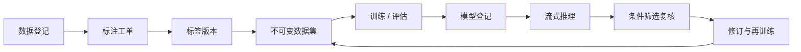
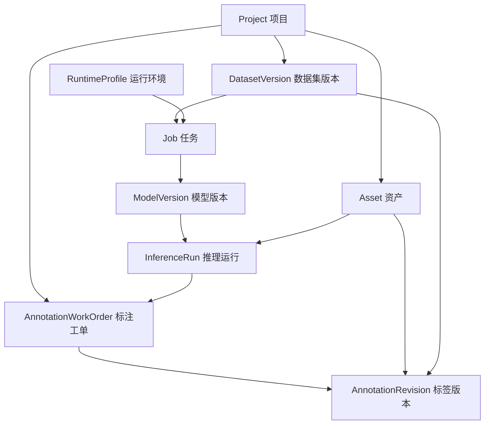

# AI模型与数据开发平台：实现Review与架构评审

> 文档日期：2026-07-22
>
> 评审对象：`steel_platform` 模块化单体平台
>
> 定位：辅助机器视觉算法开发的数据与模型工作流，不是生产线实时检测主系统
>
> 适用读者：项目负责人、算法与后端组员、测试人员和后续接手者
>
> 证据口径：文中的数量与测试结果来自2026-07-22匿名验收快照，不包含本机路径、用户信息和资源技术ID

## 1. 先说结论

当前平台已经形成一条可以人工操作、可以审计的数据闭环：



它最适合承担“AI模型与数据开发中心”的职责：整理数据、修订标注、发布数据集、训练模型、评估模型、执行离线推理并追溯结果。它不应直接承担工业相机接入、毫秒级在线推理、报警联动、生产权限和质量大屏等生产职责。

本次工程审计首先修复了一个数据一致性问题：完成、归档或取消的工单过去仍能提交决策。现在后端会返回HTTP 409和`work_order_immutable`，历史修改必须通过新的修订工单完成。随后修复了多类别项目、模型中心轮询、监测中心错误显示、前端文本转义和项目类别来源等日常问题。

## 2. 工业背景与平台边界

钢材表面缺陷检测的目标，是从钢板图片或视频中识别裂纹、夹杂、斑块、点蚀表面、轧入氧化皮和划痕等异常。算法效果不仅由YOLO结构决定，还高度依赖原图质量、标注一致性、训练/验证划分和后续误差分析。

因此整个项目应拆成两个协作系统：

| 系统 | 主要用户 | 主要职责 | 时间要求 |
|---|---|---|---|
| AI模型与数据开发中心（当前平台） | 算法、数据和测试人员 | 标注、数据集、训练、评估、模型登记、离线推理、实验追溯 | 分钟到小时级 |
| 生产线异常检测系统（未来新系统） | 操作员、质量人员、管理人员 | 相机/视频接入、实时检测、报警、设备管理、质量看板、权限和追溯 | 毫秒到秒级 |

两者通过稳定API、模型包和领域事件连接，而不是共用一个不断膨胀的前端页面。开发中心发布“已验证模型版本”；生产系统部署该版本并回传新数据、未知异常和误检漏检样本。

### 2.1 当前四个业务模块

| 模块 | 当前职责 | 主要输入 | 主要输出 |
|---|---|---|---|
| 数据中心 | 项目、数据源、集合、文件、图片详情和不可变数据集 | 原始图片、视频、外部目录、Demo包 | 已登记资产、文件清单、数据集版本 |
| 标注中心 | 初始标注、推理候选复核、条件筛选、历史档案和修订工单 | 图片、机器候选、筛选条件 | 标签版本、决策历史、工单报告 |
| 模型中心 | 训练、评估、推理、任务日志、模型库和结果展示 | 数据集、模型、运行环境和白名单参数 | 权重、指标、推理结果和任务血缘 |
| 监测中心 | 汇总平台真实业务状态并暴露加载失败 | 工单、任务、模型、数据集和推理记录 | 状态卡片、失败提示和检查入口 |

当前没有实现工业相机接入、生产线实时推理、报警联动、账号权限、生产质量大屏和在线增量学习。Godot也不在当前技术栈中。它们属于未来生产系统或研究阶段，不能在汇报时描述成已经交付的功能。

## 3. 当前业务闭环怎样工作

### 3.1 数据登记

图片可以作为只读外部来源登记，也可以导入平台托管的内容寻址资产目录。数据库保存项目、相对路径、媒体类型、大小和SHA256。文件内容不以文件名作为唯一身份，防止同名覆盖和静默变化。

### 3.2 统一标注中心

标注中心用“工单”组织人工工作：

- `manual_annotation`：对未标注图片进行初始标注；
- `inference_review`：从一次推理运行按类别、风险、置信度和数量筛选候选；
- `amendment`：从已完成工单选择图片，创建新的修订工单。

每次接受、修正、存疑或排除都会产生业务决策。有效修改创建新的标签版本，并记录父版本、来源、决策、备注、请求ID和时间。已完成工单是档案，不允许重新打开原记录修改。

项目可以选择两种策略：

- `single_class_locked`：一张图的所有框必须属于预期类别，当前钢材项目继续使用此模式；
- `multi_class`：同一张图允许不同类别框，适合通用目标检测项目。

### 3.3 不可变数据集

数据集版本冻结图片、标签版本和训练/验证角色。后续标签修订不会悄悄改变旧数据集。新训练要使用新数据，就发布一个具有父子关系的新版本；固定验证集应尽量保持不变，才能公平比较模型。

### 3.4 模型工作台

人工工作流为：

```text
选择数据集、模型和运行环境
  → 修改白名单参数
  → 生成不可变命令快照
  → 检查命令
  → 打开PowerShell并人工确认
  → 查看日志和进度
  → 校验并登记结果
```

浏览器不能提交任意Shell字符串。后端根据结构化任务规格生成参数数组，并使用`shell=False`执行。任务保存输入血缘、参数、运行环境、日志、退出码和结果清单。训练产生的权重、CSV和图表作为资产登记；推理结果关联模型、来源和候选标签版本。

### 3.5 监测中心

当前监测中心只汇总数据库已有的工单、任务、模型、数据集和推理运行。某个接口失败时页面会明确列出失败模块，其他成功模块继续显示；不会再用“0项”掩盖加载错误。

## 4. 四层代码架构

```text
src/steel_platform/
├─ domain/          领域对象、状态机、值对象和端口
├─ application/     项目、标注、资源、数据集和工作流用例
├─ infrastructure/  SQLAlchemy、SQLite、资产存储、YOLO适配与进程执行
└─ interfaces/      FastAPI路由、CLI和原生ES Modules前端
```

理想依赖方向是：`interfaces → application → domain`，基础设施通过领域端口接入。领域层不应知道FastAPI、SQLAlchemy、Pillow或Windows进程API。

当前工程已经具备这一结构，但还不是完全纯净：部分application代码直接使用SQLAlchemy、Pillow或具体基础设施类。这是已记录的技术债，应通过Repository、图片派生服务、JobExecutor和事件发布端口逐步拆出，而不是在本轮大规模重写。

### 4.1 核心领域对象与关系



- `Project`是隔离边界，类别Schema和标注策略属于项目规则。
- `Asset`表示原图、标签文件、模型、日志或结果文件，并保存内容哈希。
- `AnnotationWorkOrder`组织人工任务，`AnnotationRevision`保存不可变标签历史和父版本。
- `DatasetVersion`冻结图片、标签版本及训练/验证角色。
- `Job`保存结构化输入、白名单参数、命令快照、状态、日志和结果清单。
- `ModelVersion`记录权重、父模型、类别模式和验证状态；`InferenceRun`把模型、输入和机器预测关联起来。
- `RuntimeProfile`只描述本机CPU/CUDA环境能力，绝对解释器路径不应成为项目业务身份。

### 4.2 现有HTTP接口边界

接口统一使用`/api/v1`，项目资源必须同时携带`project_id`。下表列出能力边界，而不是重复生成一份完整OpenAPI文档。

| 接口组 | 代表性路径 | 用途与约束 |
|---|---|---|
| 项目与资源 | `GET /api/v1/projects`、`GET /api/v1/projects/{project_id}/explorer` | 项目选择、资源树和项目隔离 |
| 导入 | `POST /api/v1/projects/{project_id}/imports`及其`manifest / validate / commit`子资源 | 分阶段校验并提交Managed导入，失败可回滚 |
| 标注工单 | `GET|POST /api/v1/projects/{project_id}/annotation-work-orders` | 创建初始标注、推理复核或修订工单 |
| 条件预览与冻结 | `POST .../preview`、`POST .../{work_order_id}/freeze` | 创建前看分布，确认后冻结条件、种子和清单 |
| 工单档案 | `GET .../{work_order_id}/items|history|report`、`POST .../amendments` | 只读浏览历史，并从完成工单创建新修订 |
| 旧复核兼容 | `GET /api/v1/projects/{project_id}/review-rounds/...` | 兼容历史读取和决策；关闭工单由后端强制不可变 |
| 任务与模型 | `GET|POST .../jobs`、`POST .../prepare|terminal-launch|ingest|cancel`、`GET .../models` | 结构化创建任务、人工确认执行、日志和产物登记 |
| 资产内容 | `GET .../assets/{asset_id}/content|thumbnail`、资源详情接口 | 内联预览、正确文件名下载、缩略图与检测框详情 |
| 可移植配置 | `GET|POST /api/v1/runtime-profiles`、项目`source-bindings` | 运行环境检查和跨电脑数据源重新绑定 |

浏览器不能提交任意Shell命令；终端启动要求同源请求、任务版本号和幂等键。公共接口此次没有新增或变更，本节只记录当前代码已经提供的能力。

## 5. 技术栈各自负责什么

| 技术 | 当前职责 | 为什么使用 |
|---|---|---|
| Python 3.11 | AI工作流与平台主语言 | 与PyTorch、YOLO和图像生态连接最直接 |
| FastAPI | HTTP API、静态页面、错误处理 | 类型清晰，适合本机服务与后续AI服务接口 |
| SQLAlchemy | 数据访问和事务 | 隔离数据库细节，为后续PostgreSQL/MySQL接口演进留空间 |
| SQLite | 单机元数据数据库 | 零部署，适合当前单用户开发平台 |
| Alembic | 数据库版本迁移 | 让数据库结构随代码可控升级 |
| Pillow | 图片尺寸、缩略图和格式读取 | 轻量完成文件管理页面的图片派生 |
| 原生ES Modules | 浏览器模块化前端 | 无Node构建依赖，降低组员安装成本 |
| Canvas | 图片与检测框编辑 | 适合缩放、平移、绘制和修改YOLO框 |
| SVG | 训练损失和指标图表 | 不引入额外图表库，结果可直接在浏览器呈现 |
| YOLOv13 / Ultralytics | 训练、评估和推理 | 当前缺陷检测算法执行核心 |
| PyTorch / CUDA | 模型计算和GPU加速 | 支撑CPU兼容与NVIDIA GPU训练推理 |
| PowerShell / Conda | Windows安装、诊断和人工执行 | 符合当前团队电脑环境，便于复现 |
| Spring Boot / MySQL骨架 | 未来业务服务学习与只读投影 | 为权限、工单、报警、查询和追溯演进做准备 |

Godot不进入当前技术栈。当前看板主要是二维指标、表格、趋势和交互查询，网页前端更直接，也更易与Spring Boot API集成。

## 6. 当前实现值得保留的工程能力

### 项目隔离

项目级API同时校验`project_id`和资源ID，避免不同项目的资产、工单、模型和任务互相引用。

### 内容寻址与SHA256

托管资产按内容哈希保存；外部来源保留清单和SHA256。这样可以判断“还是不是同一份数据”，也是跨电脑重新绑定和结果追溯的基础。

### 不覆盖历史

标签修正创建子版本，数据集冻结标签版本，任务结果登记为新资产。历史证据不会因为一次新操作被覆盖。

### 原子写入和显式事务

平台产物优先采用临时文件写入后原子替换；数据库操作使用事务，失败时避免留下半完成业务记录。

### 乐观锁与幂等键

工单决策和任务操作带版本号，过期请求不能覆盖新状态；创建、冻结和启动等操作带幂等键，网络重试不会重复执行同一业务动作。

### 数据血缘与人工确认

任务保存数据集、模型、来源及哈希快照。命令生成后先由人工检查，再在PowerShell确认执行，平台不依赖大模型代替用户完成训练推理。

## 7. 本次工程审计与整改

| 优先级 | 问题与证据 | 影响 | 当前状态 |
|---|---|---|---|
| P0 | `completed / archived / cancelled`工单仍可调用决策接口并生成新标签 | 历史档案被静默改写，破坏数据一致性 | 已修复：后端409 `work_order_immutable`，前端画布、快捷键和按钮同步只读 |
| P1 | `multi_class`合法多类别框在详情查询时被`class_mismatch`拒绝 | 通用项目不能可靠使用 | 已修复：仅`single_class_locked`强制类别一致；前端保留原`class_id`并提供类别选择 |
| P1 | 模型中心轮询仍判断旧`#workbench` | 正式`#model`页面不自动刷新 | 已修复：只在`#model`执行轮询；空日志不再拼到真实日志前 |
| P1 | 监测接口异常被回退为空数组 | 故障被显示成“0项” | 已修复：并行请求保留成功模块并列出失败模块 |
| P1 | 工单名、来源名、文件名等进入`innerHTML`前未统一转义 | 可能产生DOM HTML注入 | 已修复当前实际入口：标注中心和复核工作区转义动态文本；错误文本使用`textContent` |
| P1 | 模型校验、训练模型登记、推理候选使用全局`settings.classes` | 多项目类别可能被错误拒绝或登记 | 已修复：优先读取项目`ClassSchema`，全局配置仅作为旧项目兼容回退 |
| P1 | 图片详情硬编码六类钢材代码 | 通用项目框标签显示错误 | 已修复：详情API返回项目类别表，前端动态解析 |

对应回归测试覆盖关闭工单、多类别与单类别策略、图片详情类别表、项目模型类别、训练产物类别、推理候选类别和前端契约。

### 7.1 匿名真实验收快照

本次文档更新前重新执行了主要验证。以下数字用于证明当前代码状态，不代表生产精度，也不应被当作永久不变的业务数量。

| 验证项 | 结果 | 说明 |
|---|---:|---|
| Python完整回归 | 214项通过，0项失败 | 另有1条TestClient依赖弃用警告，不是业务失败 |
| Python编译 | 通过 | `src`与`tests`均可编译 |
| JavaScript语法 | 14个脚本通过 | 13个ES Modules和1个兼容旧入口脚本 |
| SVG训练图表测试 | 通过 | 覆盖单轮数据点、多轮折线和异常值保护 |
| YOLO运行入口 | 4个通过导入 | 模型校验、推理Runner、评估和推理脚本 |
| Spring Boot骨架 | 1项测试通过，Build Success | 使用Java 21、测试Profile、H2和Flyway；不是Python平台启动依赖 |
| 数据源检查 | 2个来源、1860张原图、0项哈希异常 | 包括1800张原图来源与60张种子来源 |
| 托管资产检查 | 3930项、0项异常 | 覆盖平台登记的标签、模型、日志和运行产物 |
| 浏览器冒烟 | 通过 | 项目加载、四个导航、标注档案、模型结果与监测失败提示可用 |

验收过程没有改写原始图片、人工标签或历史训练产物。Python警告来自Starlette TestClient与httpx接口演进，后续升级测试依赖时处理即可。

## 8. 一次完整操作怎样穿过平台

下面用一条代表性路径解释“页面操作”背后形成了哪些工程证据。

1. **登记图片**：在数据中心Managed导入，或把外部来源按相对路径和SHA256登记。原目录保持只读。
2. **创建标注工单**：选择数据源/集合创建`manual_annotation`，或绑定一次推理运行创建`inference_review`。
3. **修订标签**：在Canvas中绘框并提交决策；平台校验项目类别策略并创建带父版本的`AnnotationRevision`。
4. **发布数据集**：冻结图片、标签版本和train/val角色，形成不可变`DatasetVersion`。
5. **创建任务**：在模型中心选择数据集、父模型、Runtime Profile和预设，只修改白名单参数。
6. **人工确认命令**：先生成不可变快照，再打开PowerShell；用户核对后按Enter，执行器使用参数数组和`shell=False`启动。
7. **查看结果**：日志、退出码、`best.pt`、`results.csv`、图表和推理文件经过校验后登记；模型与结果可以追溯到输入和参数。
8. **进入下一轮**：从同一次推理运行设置类别、风险、置信度、框数量和抽样上限，预览分布后冻结工单；完成工单若需调整，只能创建`amendment`。

这条路径体现的核心原则不是“把多个页面连起来”，而是每一步都留下不可覆盖、可验证、可追溯的版本证据。

### 8.1 常见故障边界与恢复

| 故障 | 平台应有行为 | 推荐恢复方法 |
|---|---|---|
| 配置文件不存在 | CLI明确提示缺失路径，不创建隐式配置 | 进入`steel_platform`目录，使用四步脚本或传入有效配置 |
| 数据库版本落后 | `/health/ready`拒绝就绪，不自动迁移 | 停止服务，先备份，再执行`steel-platform db upgrade` |
| 标签解析失败 | 其他合法版本继续显示；异常版本给出原因 | 先执行标签审计；仅对浮点微越界创建规范化子版本，不覆盖原TXT |
| 任务中断或退出码异常 | 保留日志、心跳和已有产物，状态为失败/中断 | 查看首个根因；修复后新建任务，或在产物完整时幂等重新导入 |
| GPU设备占用 | 单设备锁拒绝并发启动 | 等待前一任务结束；不要删除锁文件绕过保护 |
| 结果自动登记失败 | 任务不能只凭退出码标记成功 | 校验必需产物和哈希后使用“重新导入结果” |
| 数据源或资产哈希异常 | 项目/资产检查返回非零异常 | 停止发布与训练，定位缺失或变化文件；禁止手工篡改数据库哈希 |

## 9. P2技术债与建议顺序

以下事项不会阻断当前开发平台使用，但应进入后续迭代清单：

1. 表单提交期间统一禁用按钮，避免快速双击；业务幂等仍由后端兜底。
2. GPU设备锁记录PID、创建时间和心跳，提供失效锁恢复。
3. Outbox记录失败原因、重试次数和下次重试时间。
4. 修正冻结工单重复发送`annotation.work_order.created`的事件语义。
5. 统一Python包、API、Demo包和文档版本号。
6. 将Runtime Profile注册表迁移到明确的机器配置目录，不混入业务资产。
7. 逐步清理application层对SQLAlchemy、Pillow和infrastructure实现的直接依赖。
8. 删除或隔离不再由`index.html`加载的旧前端入口，避免两套复核UI长期并存。

## 10. 与未来生产系统如何协作

| 类别 | 能力 |
|---|---|
| 保留在开发中心 | 数据登记、标注、修订、数据集版本、训练、评估、模型登记、实验追踪 |
| 需要稳定化 | 模型包格式、项目类别Schema、任务执行端口、对象存储接口、领域事件、查询API |
| 生产系统新增 | 摄像头与视频流、边缘推理、报警、设备状态、权限、质量趋势、班次/批次追溯 |

建议协作结构：

```text
摄像头 / 视频 / 边缘设备
        ↓
Python AI服务：抽帧、YOLO推理、未知样本检测、结果解析
        ↓  稳定API与领域事件
Java Spring Boot：项目、权限、报警、复核、查询、追溯
        ↓
MySQL元数据 + 对象/文件存储
        ↓
网页看板：实时状态、缺陷分布、趋势、报警和工单
        ↓
受控AI Agent：通过Java查询API生成日报和解释异常
```

Python继续负责算法密集型工作；Java负责长期运行的业务规则、权限和查询；MySQL保存生产元数据；大文件进入对象存储；AI Agent不直接读写数据库。

### 10.1 增量学习的正确边界

当前平台已经能收集新样本、修订标签、发布新数据集并重新训练，但这仍是“人工控制的迭代训练”，不是已经实现的在线增量学习。

后续研究若要解决端侧出现未知异常的问题，至少需要：

1. 端侧把低置信度、无框、分布外或人工报警样本安全回传；
2. 服务端进行人工确认，未知样本不能自动成为新类别真值；
3. 使用经验回放、知识蒸馏或参数约束降低灾难性遗忘；
4. 新旧模型必须使用同一固定验证集，并额外评估旧类别保持率和新类别指标；
5. 模型包经过审批、签名、灰度部署和回滚准备后，才能更新端侧。

因此增量学习首先是一个“数据治理、评估和模型发布”问题，其次才是选择算法。现有数据血缘和模型登记能力可以复用，但未知检测、训练策略和端侧发布仍需独立设计与实现。

## 11. 学习路线

### 第一阶段：读懂当前平台

- 理解YOLO标签、Precision、Recall、mAP和混淆矩阵；
- 沿一次图片修改追踪`asset → annotation_revision → dataset_member → job → model`；
- 学会FastAPI路由、application service、Repository和SQLAlchemy事务；
- 用浏览器Network面板观察项目级API。

### 第二阶段：后端工程化

- 学习REST、状态机、幂等、乐观锁、事务和Outbox；
- 学习MySQL索引、事务隔离和查询计划；
- 用Spring Boot实现只读项目/工单投影和分页查询；
- 为Python与Java定义OpenAPI和事件Schema。

### 第三阶段：生产检测与增量闭环

- 学习OpenCV视频流、线程/队列、背压和GPU服务；
- 研究开放集识别、异常检测、主动学习、经验回放和灾难性遗忘；
- 建立“端侧发现未知样本 → 服务端复核与增量训练 → 固定验证 → 灰度发布 → 端侧回滚”的模型发布流程；
- 再设计工业看板、报警分级、批次追溯和权限。

## 12. 10—15分钟组内汇报提纲

1. **1分钟：问题背景**——缺陷检测不只是训练模型，还要管理数据、标签和版本。
2. **2分钟：平台定位**——当前是AI模型与数据开发中心，与生产线实时检测系统分开。
3. **3分钟：业务闭环**——展示数据登记、标注工单、不可变数据集、训练评估、推理与下一轮复核。
4. **3分钟：工程实现**——四层架构、FastAPI/SQLAlchemy/SQLite、内容寻址、SHA256、幂等和血缘。
5. **2分钟：本次审计**——重点说明关闭工单仍可修改、多类别失败、错误吞没和类别来源问题如何修复。
6. **2分钟：未来架构**——Python AI服务、Spring Boot、MySQL、看板和AI Agent各自负责什么。
7. **1—2分钟：请组员反馈**——确认生产需求、看板角色、端侧硬件、未知异常处理和模型发布约束。

## 13. 评审时建议向负责人确认的问题

- 端侧输入是工业相机、视频文件还是两者都要？帧率和允许延迟是多少？
- 报警需要哪些等级，是否关联钢卷、批次、工位和班次？
- 未知异常是立即停线、进入人工队列，还是只记录后集中训练？
- 模型更新是否需要审批、灰度、签名、版本回滚和离线安装？
- 看板的用户角色有哪些：操作员、质量人员、算法人员还是管理人员？
- 原始视频保留多久，帧、结果和日志的存储量级是多少？

这些答案会决定生产系统的接口、数据库、部署方式和UI，而不应反向污染当前开发中心的核心数据血缘。
