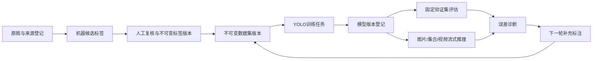

# 钢材缺陷模型下一阶段迭代：学习与操作手册

> 文档状态：当前平台操作指南 + 后续功能设计说明  
> 生成日期：2026-07-18  
> 适用项目：`ImageDefectDetectionDemo/yolov13-main/steel_platform`  
> 重要边界：第 4～7 章是当前可以执行的操作；第 8～9 章中的“条件筛选复核队列”尚未实现。

## 1. 先明确我们现在处于什么阶段

这个项目解决的是工业流水线上钢材表面缺陷的目标检测问题。工业相机获得钢板图片或视频后，模型需要回答两个问题：

1. 图像中有没有缺陷；
2. 缺陷属于哪一类、位于什么位置。

当前类别模式为 `steel-defects-v1`，包含六类：

| 类别编号 | 代码 | 中文名称 | 学习时重点观察 |
| ---: | --- | --- | --- |
| 0 | Cr | 裂纹 | 细长、分叉或不规则的裂纹区域 |
| 1 | In | 夹杂 | 局部异物、夹杂物形成的异常区域 |
| 2 | Pa | 斑块 | 面积较大的不规则斑块 |
| 3 | PS | 点蚀表面 | 密集或分散的点状凹坑、粗糙区域 |
| 4 | RS | 轧入氧化皮 | 轧制过程中压入表面的氧化皮区域 |
| 5 | Sc | 划痕 | 细长、方向性较明显的擦划痕迹 |

平台已经不再只是“运行一个YOLO脚本”，而是在保存一条可以审计的数据血缘：



这条链路中最重要的思想是：原图、机器预测和人工标签是不同证据，不能互相覆盖。一次模型训练必须能够追溯到具体的数据集版本、标签版本、父模型、参数和运行日志。

### 1.1 当前阶段目标

下一阶段不是立即追求一个更高的数字，而是完成下面的判断：

1. 在固定验证集上重新执行一次人工可控的评估流程；
2. 识别低指标究竟来自模型能力不足、样本不足，还是标签遗漏/错误；
3. 形成可复查的问题样本清单；
4. 确认需要补充标注后，再建立新的复核轮次和不可变数据集；
5. 用同一固定验证集比较新旧模型。

在问题样本还没有完成复核和审计前，不应发布 `steel-dataset-v3`。

## 2. 当前数据与模型基线

以下数字于 2026-07-18 从 `config/platform.local.yaml` 指向的SQLite数据库和资产存储中读取。它们是阶段快照，不是写死的验收常量；之后导入数据或运行任务，数字会继续变化。

| 对象 | 当前数量 | 含义 |
| --- | ---: | --- |
| 项目 | 1 | 当前为 `steel-surface-demo` |
| 数据源 | 2 | 1800张原图来源 + 60张种子数据集来源 |
| 平台资产记录 | 2302 | 包含图片、模型、日志和运行结果等登记资产 |
| 标签修订版本 | 3527 | 包含机器候选、人工确认及修订历史 |
| 复核轮次 | 2 | 首轮训练复核225项，第二轮审计60项 |
| 复核条目 | 285 | 已修正251、存疑5、排除29 |
| 数据集版本 | 1 | `steel-dataset-v2-round-1` |
| 数据集成员 | 240 | 训练168张、验证72张 |
| 任务 | 15 | 成功12、失败3；失败记录被保留用于审计 |
| 实验运行 | 1 | 已登记的训练实验 |
| 模型版本 | 1 | `steel-v2-5b919542`，六类检测器 |
| 推理运行 | 8 | 包含单图、集合和视频管线验证 |
| 指标快照 | 1 | 已登记模型的固定验证指标 |

当前数据源检查结果为：

- 登记来源资产：1860；
- 原始NEU图片：1800；
- 候选标签：1614；
- 数据源哈希异常：0；
- 资产引用检查：3910项，异常0。

“平台资产2302”“来源资产1860”和“资产引用3910”是三个不同口径：前者是数据库资产行，第二个只统计外部来源文件，第三个检查所有不可变资产引用。不能简单将它们互相相减来判断缺失。

### 2.1 当前固定验证集指标

当前模型在72张固定验证图上的阶段性指标如下：

| 类别 | Precision | Recall | mAP50 | mAP50-95 |
| --- | ---: | ---: | ---: | ---: |
| 总体 | 0.6957 | 0.5912 | 0.6534 | 0.3720 |
| Cr（裂纹） | 0.7759 | 0.5584 | 0.6409 | 0.3760 |
| In（夹杂） | 0.8464 | 0.8256 | 0.8821 | 0.5412 |
| Pa（斑块） | 0.7003 | 0.5966 | 0.6597 | 0.3621 |
| PS（点蚀表面） | 0.5266 | 0.2813 | 0.3483 | 0.1273 |
| RS（轧入氧化皮） | 0.8484 | 0.7237 | 0.8574 | 0.5828 |
| Sc（划痕） | 0.4765 | 0.5616 | 0.5320 | 0.2426 |

这个结果说明PS和Sc值得优先检查，但不能直接推导出“模型不会识别这两类”。如果验证标签漏标，模型给出的正确框也可能被统计成误检；如果标签框偏移，模型预测与标签可能同时产生一个假阳性和一个假阴性。因此必须先看具体图片。

### 2.2 最新1轮冒烟训练

最新的工作台冒烟训练只有1轮：

| Precision | Recall | mAP50 | mAP50-95 |
| ---: | ---: | ---: | ---: |
| 0.6881 | 0.6073 | 0.6538 | 0.3665 |

一轮训练的意义是证明以下链路可以工作：

- 数据集能够被YOLO读取；
- 父模型可以加载；
- CUDA、显存和AMP能够运行；
- 训练结果、权重和 `results.csv` 能被平台登记；
- 浏览器可以显示曲线和下载产物。

它不代表模型已经收敛，也不能与100轮正式模型做性能结论。

## 3. 指标知识：怎样读懂结果

### 3.1 IoU、TP、FP和FN

- **IoU**：预测框与真实框交集面积除以并集面积，用于衡量两个框的重合程度。
- **TP（真正例）**：类别正确且框与真实框达到匹配阈值。
- **FP（假正例）**：模型给出了框，但没有匹配到正确真实框；中文通常称误检。
- **FN（假负例）**：真实缺陷没有被模型正确检出；中文通常称漏检。

### 3.2 Precision与Recall

```text
Precision = TP / (TP + FP)
Recall    = TP / (TP + FN)
```

- Precision低：模型给出的框中错误比例较高，或验证集漏标导致正确预测被当成FP。
- Recall低：真实缺陷有较多没有被检出，或真实框/类别标错导致匹配失败。
- 两者同时低：常见于类别混淆、标注不一致、框位置偏差或样本不足。

### 3.3 mAP50与mAP50-95

- `mAP50`：在 `IoU=0.50` 时计算各类别AP后求平均，容许的框位置误差相对宽松。
- `mAP50-95`：在0.50到0.95的多个IoU阈值上求平均，更严格地考察分类和定位质量。

如果mAP50尚可、mAP50-95明显偏低，通常要重点检查框是否过大、过小、偏移，或缺陷边界本身是否定义不一致。

### 3.4 混淆矩阵、PR曲线和F1曲线

- **混淆矩阵**：观察哪两个类别经常互相混淆，以及缺陷与背景之间的误判。
- **PR曲线**：观察置信度阈值变化时Precision与Recall的权衡。
- **F1曲线**：综合Precision与Recall，帮助选取推理阈值。
- **损失曲线**：判断训练是否收敛或过拟合；不能单独替代验证指标。

## 4. 操作前检查与备份

本章开始的步骤现在就可以执行。

### 4.1 进入正确环境和目录

打开Anaconda PowerShell Prompt或PowerShell：

```powershell
conda activate steel-review
Set-Location "<工作区>\AI\ImageDefectDetectionDemo\yolov13-main\steel_platform"
```

将 `<工作区>` 替换为本机“钢材表面异常视觉检测”目录。之后所有相对路径都以 `steel_platform` 为当前目录。

先确认CLI真实存在：

```powershell
steel-platform --help
steel-platform project --help
steel-platform review --help
steel-platform jobs --help
```

当前CLI没有通用集合管理、任意项目创建或managed导入子命令；不要照搬旧教程中的同名示例。

### 4.2 停止服务并创建备份

如果平台正在运行，在服务终端按 `Ctrl+C`。确认服务停止后执行：

```powershell
steel-platform backup create --config config\platform.local.yaml
```

预期结果是输出新备份目录。不要在平台运行时手动复制或覆盖SQLite数据库。

### 4.3 检查项目和资产

```powershell
steel-platform project check --config config\platform.local.yaml
steel-platform artifacts verify --config config\platform.local.yaml
steel-platform project list --json --config config\platform.local.yaml
```

检查重点：

- 每个数据源都显示可读取；
- `哈希异常=0`；
- 资产检查显示 `异常 0 项`；
- 项目列表中能够看到当前项目ID。

如果数据库提示需要升级，先保留刚才的备份，再运行：

```powershell
steel-platform db upgrade --config config\platform.local.yaml
steel-platform project check --config config\platform.local.yaml
```

### 4.4 启动平台

```powershell
steel-platform serve --config config\platform.local.yaml
```

浏览器打开 `http://127.0.0.1:8765`。就绪接口应返回 `{"status":"ready"}`：

- `http://127.0.0.1:8765/health/live`
- `http://127.0.0.1:8765/health/ready`

## 5. 当前操作一：执行固定验证集评估

### 5.1 操作目的

用当前已登记模型和同一个72张验证集执行一次标准评估。这样后续v3模型仍使用这72张图评估，才能进行公平比较。

### 5.2 页面操作

1. 在顶部项目选择器选择 `steel-surface-demo`。
2. 打开“模型工作台”。
3. 进入“新建训练”；该页面同时负责训练和评估。
4. 将“任务类型”改为“评估”。
5. 填写建议任务名称，例如 `v2-固定验证集评估-20260718`。
6. 数据集选择 `steel-dataset-v2-round-1`。
7. 待评估模型选择 `steel-v2-5b919542`。
8. 设备选择配置允许的GPU设备，当前通常为 `0`。
9. 建议保留：
   - 图像尺寸：640；
   - 批大小：4；
   - 工作进程：0。
10. 点击“创建草稿任务”。

评估任务会自动使用 `fixed_val` 预设，不使用训练轮数和早停参数。

### 5.3 检查并冻结命令

进入“任务中心”，选择刚创建的草稿：

1. 核对任务类型为“模型评估”；
2. 点击“生成并冻结命令”；
3. 查看命令预览；
4. 确认命令包含正确的数据集、模型和独立输出目录；
5. 确认执行模块为 `steel_tutorial.06_evaluate`；
6. 确认没有指向旧中文项目目录；
7. 冻结后不要再尝试修改本次参数；需要调整时新建任务。

命令快照是审计证据。它表示“哪一个模型，用哪一个数据集，以哪些参数执行了评估”。

### 5.4 人工启动

点击“打开PowerShell”。新终端会再次显示任务摘要和YOLO命令：

- 核对无误后按 `Enter`；
- 输入 `C` 可以在执行前取消；
- 不要同时启动第二个GPU训练或推理任务。

执行期间回到“任务中心”，观察：

- 状态是否从“就绪”变为“运行中”；
- 进度与心跳是否更新；
- 日志中是否正确识别72张验证图片；
- 显存是否稳定。

### 5.5 结果验收

状态成功后，在“结果视图”检查：

- `metrics_summary.json`；
- 混淆矩阵；
- PR、P、R和F1曲线；
- 逐类Precision、Recall、mAP50、mAP50-95；
- 日志、运行参数和结果清单。

模型库中的评估状态应更新为“已评估”。若任务已生成完整产物但自动登记失败，保留任务目录并点击“重新导入结果”，不要复制文件覆盖旧结果。

## 6. 当前操作二：人工进行误检、漏检和标签质量分析

### 6.1 为什么必须看图片

指标只能告诉我们“哪里可能有问题”，不能告诉我们原因。以PS召回率0.2813为例，至少可能有四种解释：

1. 模型没有学会PS纹理；
2. 训练集中PS有效样本不足；
3. 验证标签漏掉了一部分点蚀框；
4. PS和其他纹理的类别边界在标注时不一致。

因此下一步要从模型结果返回原图，比较人工标签、机器预测和图像本身。

### 6.2 当前平台中的查看路径

1. 进入“文件”页面；
2. 在左侧资源树选择固定数据集、复核任务或推理运行；
3. 打开图片缩略图；
4. 在图片详情中查看原图和Canvas检测框；
5. 通过右侧版本选择，比较当前人工版本、冻结数据集版本和机器预测版本；
6. 对推理结果，也可以从模型工作台“任务中心 → 结果视图”进入相关文件。

图片详情是只读检查入口；不要为了方便而直接覆盖原TXT。

### 6.3 问题样本记录表

当前尚没有通用的阈值筛选复核队列。现阶段请先建立问题清单，而不是假设系统已经能自动建队列。建议用CSV或表格记录：

| 字段 | 填写内容 |
| --- | --- |
| 文件名 | 原始图片文件名 |
| 资产ID | 平台中的图片资产ID |
| 推理运行ID | 产生候选框的单次推理运行 |
| 模型ID | 产生预测的模型版本 |
| 预期类别 | 当前人工标签或来源类别 |
| 预测类别 | 模型预测类别；无框时写“无框” |
| 最低置信度 | 图片所有预测框中的最小值 |
| 最高置信度 | 图片所有预测框中的最大值 |
| 错误类型 | 漏标、错标、框偏移、类别混淆、模型误检、模型漏检 |
| 是否需重标 | 是/否 |
| 备注 | 判断依据和需要复核的位置 |

建议先检查：

- PS和Sc的全部固定验证图；
- 混淆矩阵中错误较多的类别组合；
- 无预测框的图；
- 置信度低但肉眼可见缺陷的图；
- 模型框与人工框明显错位的图；
- 同一张图中存在多个同类缺陷但标签框数不足的图。

### 6.4 六种错误类型如何判定

| 类型 | 现象 | 对指标的可能影响 | 处理 |
| --- | --- | --- | --- |
| 漏标 | 图中有缺陷但人工标签缺框 | 正确预测可能被记为FP，Precision下降 | 增加人工标签版本 |
| 错标 | 标签类别与实际缺陷不符 | 原类别FN、错误类别FP | 更正类别并复核相邻类别 |
| 框偏移 | 框过大、过小或没有覆盖主体 | mAP50-95明显下降 | 统一框选边界 |
| 类别混淆 | 模型持续把A识别为B | Precision和Recall均可能下降 | 检查定义、补充边界样本 |
| 模型误检 | 背景纹理被识别为缺陷 | Precision下降 | 增加困难负例或改善训练 |
| 模型漏检 | 标签正确但模型无框 | Recall下降 | 补样、训练或调整推理阈值 |

### 6.5 PS与Sc标注检查提示

这些提示用于辅助一致性判断，不替代团队统一的标注规范：

- PS：检查点蚀是否成片出现、是否只框了最明显区域、同图多个分散区域是否遗漏。
- Sc：检查细长划痕是否被当作背景纹理、是否只框了局部、多个平行划痕是否需要分别框选。
- 不确定时标记为“存疑”，不要为了凑数量强行接受。
- 同一类的相似图片应使用相同边界规则。

其他四类同样适用，不要把质量诊断固定为PS/Sc专项。

## 7. 是否进入补充标注：决策门

完成误差记录后再做决定。满足以下任一情况，建议进入补充标注：

- 某类固定验证图中出现多次明显漏标或错标；
- 某类召回率明显低于其他类别，并能在图片中确认是真实漏检；
- 同类框边界标准不一致，导致mAP50与mAP50-95差距异常；
- 无框、类别冲突或低置信度样本集中出现；
- 模型错误集中在某种表面纹理、尺度或拍摄条件。

如果问题主要来自验证集标签错误，先修正验证标签，然后让v2和未来v3模型都在同一份修正后的固定验证集上重新评估。只重新评估v3会破坏公平性。

如果问题主要来自模型能力不足，则补充训练样本；不要把新补样直接混入固定验证集。

### 当前停止线

> 通用“条件筛选复核队列”尚未实现。当前可以完成评估、图片核查和问题记录，但不要把临时问题清单直接当成已审计的数据集，也不要提前发布v3。

## 8. 待实现：通用条件筛选复核队列

本章是后续功能设计，不是当前页面操作说明。

### 8.1 设计目标

复核入口不绑定PS或Sc，而是从当前项目的类别模式动态读取类别。用户可以针对任意一个、多类或全部类别创建队列。

一轮队列只绑定一次推理运行，原因是：

- 模型版本一致；
- 推理阈值一致；
- 置信度具有可比性；
- 标签父版本和运行日志可以完整追溯。

### 8.2 可人工设置的筛选条件

- 预期类别：单选、多选或全部；
- 风险状态：无框、类别冲突、低置信度等；
- 置信度条件：默认语义为 `min_confidence <= 人工阈值`；
- 预测类别：用于定位特定类别混淆；
- 框数量范围：用于发现框数异常和漏框；
- 模型差异分数下限：用于比较不同模型时排序；
- 总样本上限；
- 每类样本上限；
- 是否排除已人工复核图片；
- 随机种子和多样性抽样比例。

“无框”必须是独立条件。因为图片没有候选框时，`min_confidence` 为空，不能错误地将其当成0或普通低置信度。

### 8.3 阈值怎样选择

例如从0.40开始预览，而不是直接创建：

- 阈值较高：匹配更多图片，漏掉困难样本的风险低，但复核量上升；
- 阈值较低：集中查看模型最不确定的图片，效率高，但可能遗漏中等置信度错误；
- 只筛低置信度不能覆盖无框样本，因此要同时勾选“无框”；
- 类别冲突通常应单独作为高风险条件。

正确流程是“设阈值 → 看匹配数量和逐类分布 → 调整 → 再冻结”，而不是为凑固定数量随意改变标准。

### 8.4 创建前预览

页面至少应显示：

- 匹配候选总数；
- 最终抽样数；
- 逐类数量；
- 风险状态分布；
- 置信度区间分布；
- 已复核排除数量；
- 各类不足配额的警告；
- 示例缩略图。

### 8.5 创建后的不可变快照

创建队列后冻结：

- 推理运行ID和模型ID；
- 候选预测及父标签版本；
- 类别和风险条件；
- 阈值、数量上限和抽样策略；
- 随机种子；
- 最终图片清单及哈希；
- 创建时间和创建者备注。

之后即使修改筛选器或产生新的推理结果，也不能改变已经开始的复核轮次。

## 9. 队列入口实现后的完整v3路线

以下路线需要第8章功能完成后执行。

### 9.1 创建复核轮次

1. 选择一个已完成并登记的推理运行；
2. 选择任意类别或全部类别；
3. 勾选无框、类别冲突等风险；
4. 设置人工置信度阈值；
5. 设置总量或逐类上限；
6. 默认排除已经人工复核的图片；
7. 预览数量和分布；
8. 冻结清单并创建复核轮次。

### 9.2 人工复核

- 接受：机器框完整且边界符合规范；
- 修正：移动、缩放、删除或新增框后保存；
- 存疑：暂时无法可靠判断，保存草稿；
- 排除：图像无有效缺陷或不适合训练，必须填写原因。

存疑和排除不能凑入有效训练配额。

### 9.3 发布v3数据集

发布前检查：

- 标签格式与坐标范围合法；
- 图片和标签一一对应；
- 当前标签类别符合项目类别模式；
- 没有重复图片或哈希重复；
- 同一图片没有跨训练/验证划分泄漏；
- 新补充样本进入训练集；
- 固定72张验证图片不被替换或移动；
- 每个成员都引用明确的标签版本。

如果固定验证集标签被纠正，应冻结新的验证标签版本，并让v2、v3都在这同一版本上重新评估。

### 9.4 冒烟训练

在模型工作台：

1. “新建训练”选择v3数据集；
2. 父模型选择当前正式v2模型；
3. 选择“冒烟训练（1轮）”；
4. 保留 `imgsz=640`、`batch=4`、`workers=0`、`device=0`；
5. 生成并冻结命令；
6. 打开PowerShell并人工确认；
7. 检查 `best.pt`、`last.pt`、`results.csv` 和图表。

只有冒烟成功后才进入正式训练。

### 9.5 正式训练

使用“正式训练（100轮）”预设，重点核对：

- `epochs=100`；
- `imgsz=640`；
- `batch=4`；
- `patience=20`；
- `workers=0`；
- 父模型和数据集版本正确；
- 输出目录属于新任务，不覆盖旧模型。

### 9.6 公平比较v2与v3

用相同固定验证集分别评估两个模型，形成对照表：

| 指标 | v2 | v3 | 变化 | 解释 |
| --- | ---: | ---: | ---: | --- |
| 总体Precision |  |  |  |  |
| 总体Recall |  |  |  |  |
| 总体mAP50 |  |  |  |  |
| 总体mAP50-95 |  |  |  |  |
| 各类Precision/Recall |  |  |  |  |

还要比较：

- 混淆矩阵中的类别互相误判；
- PR/F1曲线；
- 相同图片上的误检、漏检和框位置；
- v3是否提高目标类别却损害其他类别；
- 推理速度与显存。

## 10. 常见故障与恢复

### 10.1 配置文件不存在

错误类似：

```text
Invalid value: 配置文件不存在：steel-platform\config\platform.local.yaml
```

原因通常是当前目录不对。进入 `yolov13-main/steel_platform` 后使用：

```powershell
steel-platform serve --config config\platform.local.yaml
```

也可以传入配置文件绝对路径。不要把 `steel-platform` 同时当作命令名和目录名拼入相对路径。

### 10.2 数据库需要升级

先停止服务、备份，然后升级：

```powershell
steel-platform backup create --config config\platform.local.yaml
steel-platform db upgrade --config config\platform.local.yaml
steel-platform project check --config config\platform.local.yaml
```

不要手工修改Alembic版本表。

### 10.3 服务已经被占用

平台使用单实例锁保护同一个SQLite工作区。确认是否已有另一个 `steel-platform serve` 终端；关闭旧服务后再启动。不要同时打开两个服务进程写同一数据库。

### 10.4 GPU显存不足

训练时按以下顺序处理：

1. 确认没有第二个GPU任务；
2. 将batch从4降到2，再降到1；
3. 必要时将imgsz从640降到512或更低的32倍数；
4. 保持Windows `workers=0`；
5. 保留AMP；
6. 新建任务记录参数变化，不覆盖原任务。

推理必须保持 `batch=1` 和流式处理。不要一次把整个图片目录或全部视频帧读入内存。

### 10.5 任务失败或中断

- 先查看任务中心日志和退出码；
- 不删除任务目录；
- 若产物完整但登记失败，使用“重新导入结果”；
- 若进程仍运行，使用“取消任务”等待安全检查点；
- 修复原因后新建任务，保留失败任务用于审计。

### 10.6 结果文件缺失

训练任务至少应产生：

- `weights/best.pt`；
- `weights/last.pt`；
- `results.csv`。

评估任务至少应产生 `metrics_summary.json`。缺少预期产物时不能只根据退出码登记成功。

### 10.7 浏览器页面没有更新

确认服务仍在运行，然后按 `Ctrl+F5`。再检查：

```powershell
steel-platform project check --config config\platform.local.yaml
steel-platform artifacts verify --config config\platform.local.yaml
```

## 11. 数据与模型验收表

### 11.1 发布数据集前

- [ ] 原图哈希未变化。
- [ ] 图片与标签一一对应。
- [ ] 所有框坐标在合法范围内且面积大于0。
- [ ] 类别来自项目类别模式。
- [ ] 存疑和排除样本未计入有效配额。
- [ ] 训练与验证集没有图片或哈希泄漏。
- [ ] 固定验证图片没有被新增训练样本替换。
- [ ] 每个成员都固定到明确标签版本。
- [ ] 清单、父数据集和创建时间已保存。

### 11.2 训练完成后

- [ ] 任务状态、退出码和日志一致。
- [ ] `best.pt`、`last.pt`、`results.csv` 完整。
- [ ] 训练和验证损失没有NaN或Infinity。
- [ ] 冒烟训练只用于验证管线。
- [ ] 正式训练关联正确数据集和父模型。
- [ ] 训练图表、参数和结果清单可以在平台查看。

### 11.3 模型登记后

- [ ] 权重SHA256已登记。
- [ ] 模型类别数量和顺序通过校验。
- [ ] 模型用途为基础权重或缺陷检测器。
- [ ] 固定验证指标已保存。
- [ ] 推理任务能够追溯到模型、来源和参数。
- [ ] 新模型没有覆盖旧模型资产。

## 12. 一页式下一阶段操作检查表

### A. 现在立即执行

- [ ] 激活 `steel-review` 环境并进入 `steel_platform`。
- [ ] 查看 `steel-platform --help`，确认当前命令。
- [ ] 停止服务并创建备份。
- [ ] 运行 `project check`，确认所有数据源异常为0。
- [ ] 运行 `artifacts verify`，确认资产异常为0。
- [ ] 启动平台并确认 `/health/ready`。
- [ ] 在模型工作台创建固定验证集评估草稿。
- [ ] 核对数据集、模型、设备和命令快照。
- [ ] 人工在PowerShell中确认执行。
- [ ] 保存逐类指标、混淆矩阵、PR/F1曲线。
- [ ] 检查PS、Sc以及其他异常类别的原图和框。
- [ ] 建立问题样本记录表。
- [ ] 将错误区分为标签问题和模型问题。

### B. 当前不要执行

- [ ] 不把1轮冒烟结果解释为正式精度。
- [ ] 不覆盖原图、人工标签、模型或历史运行。
- [ ] 不使用旧版集合管理CLI示例。
- [ ] 不把无框样本简单当作 `confidence=0`。
- [ ] 不在专项复核入口尚未实现时发布v3。

### C. 条件筛选复核入口实现后

- [ ] 选择单次推理运行。
- [ ] 动态选择任意类别或全部类别。
- [ ] 设置无框、冲突和低置信度条件。
- [ ] 预览匹配数、逐类分布和风险分布。
- [ ] 冻结筛选条件、随机种子和图片清单。
- [ ] 完成人工复核和标签审计。
- [ ] 发布不可变v3数据集。
- [ ] 保留72张固定验证图片。
- [ ] 先运行1轮冒烟训练。
- [ ] 再运行100轮正式训练。
- [ ] 用同一固定验证集评估v2和v3。
- [ ] 比较指标与具体误检、漏检案例。

## 13. 本阶段完成标准

完成本阶段不是“模型达到某个随意设定的百分比”，而是：

1. 你能够不依赖大模型，独立启动、检查和备份平台；
2. 你能够通过模型工作台创建、核对和人工执行评估任务；
3. 你能解释Precision、Recall、mAP和混淆矩阵；
4. 你能从具体图片区分标签问题与模型问题；
5. 你已经形成可追溯的问题样本清单；
6. 你能说明为什么此时应该或不应该补充标注；
7. 在条件筛选复核入口实现前，你没有提前发布缺乏审计的数据集。

下一项平台开发任务是“通用条件筛选复核队列”，而不是一个只服务PS/Sc的写死入口。
