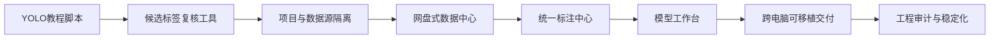
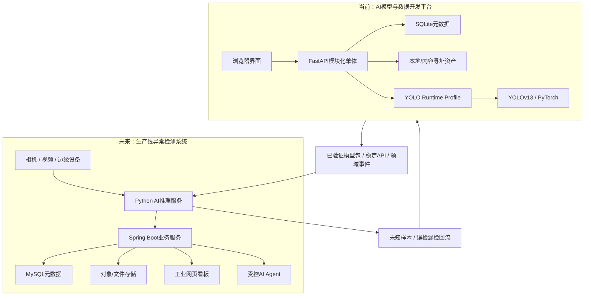

# 钢材表面异常视觉项目与辅助平台建设复盘

> 文档日期：2026-07-22
>
> 文档性质：项目进展、建设过程与阶段思考总结
>
> 适用读者：项目负责人、组内开发人员、算法与测试人员、后续接手者
>
> 阅读目标：理解平台为什么出现、怎样一步步演变、当前能做什么，以及下一阶段为什么要这样推进

## 0. 先说这份文档讲什么

这不是一份代码审计报告，也不是单纯的安装教程。它试图回答一个更基础的问题：我们为什么会从“训练一个YOLO模型”，逐渐走到“搭建一个数据与模型辅助平台”？

回头看，平台并不是在项目开始时一次性设计出来的。它是在处理真实数据、人工复核、训练失败、路径迁移、页面使用和组员交付等问题时逐步形成的。每次新需求都暴露出上一阶段的边界，平台也因此经历了从脚本、复核工具、项目化文件管理，到标注中心、模型工作台和可移植交付的连续演变。

这段过程最值得总结的，不只是最终写出了哪些页面和接口，而是我们逐步认识到：机器视觉项目的难点不只在模型结构，还在数据、标签、版本、人工判断、运行环境和结果追溯能否形成一条稳定闭环。

## 1. 项目背景与原始目标

### 1.1 最初要解决的工业问题

项目面向钢材表面异常检测，希望使用YOLO系列目标检测模型识别六类缺陷：

| 代码 | 中文名称 | 典型特点 |
|---|---|---|
| Cr | 裂纹 | 细长、分叉或不规则裂纹 |
| In | 夹杂 | 表面局部异物或夹杂区域 |
| Pa | 斑块 | 面积较大的不规则斑块 |
| PS | 点蚀表面 | 密集或分散的点状凹坑、粗糙区域 |
| RS | 轧入氧化皮 | 轧制过程中压入表面的氧化皮 |
| Sc | 划痕 | 具有明显方向性的细长擦划痕迹 |

最直接的技术目标很清楚：准备训练数据，完成YOLO训练，在图片或视频上推理，并观察Precision、Recall、mAP和实际检测框。

但随着工作推进，问题很快从“模型能不能运行”变成了：

- 原图、机器预测和人工标签如何区分；
- 标注错误和模型错误如何分别判断；
- 不同来源、不同任务的数据如何隔离；
- 一次训练到底使用了哪一版标签；
- 模型、参数、日志和结果如何保存；
- 换一台电脑后，其他组员能否复现同样的流程。

这些问题不能靠继续增加训练脚本解决，这正是辅助平台出现的原因。

### 1.2 当前平台和最终产品不是同一个系统

项目逐渐明确了两类不同的产品目标。

| 系统 | 面向用户 | 主要职责 |
|---|---|---|
| AI模型与数据开发平台（当前成果） | 算法、数据、测试和开发人员 | 数据整理、标注复核、数据集发布、训练、评估、离线推理和实验追溯 |
| 生产线异常检测系统（未来产品） | 操作员、质量人员和管理人员 | 相机/视频接入、实时推理、异常报警、设备状态、质量趋势、权限和批次追溯 |

当前平台的价值，是帮助团队可靠地产生和验证模型；未来生产系统的价值，是让经过验证的模型稳定运行在真实生产环境。两者需要连接，但不能混成一个边界模糊的“大页面”。

## 2. 平台是怎样一步步形成的

### 2.1 第一阶段：先跑通算法脚本

最初的重点是验证YOLO流程本身。`steel_tutorial`承担了数据准备、训练、评估和推理等步骤。这个阶段的意义是快速证明：数据格式可用、模型能够训练、权重能够推理、结果能够生成。

脚本方式在探索期很有效，因为成本低、反馈快。但当训练次数增多、数据版本变化、人工标注介入后，脚本开始暴露局限：运行顺序依赖记忆，路径写在本机环境中，结果散落在不同目录，某个模型对应哪批标签也不容易追溯。

### 2.2 第二阶段：从机器候选走向人工复核

模型生成的候选框不能直接当作人工真值。特别是PS和Sc等类别，如果前期没有统一理解缺陷形态，可能出现漏标、错标或框选边界不一致。

因此加入了复核工具，让人工能够接受、修正、存疑或排除候选标签。这一步第一次把“算法输出”和“业务认可”区分开，也让项目认识到：标注不是一个一次性文件，而是一组需要版本记录的判断过程。

### 2.3 第三阶段：285项队列暴露了资源隔离问题

人工实际复核了前60张图片，但页面队列显示285项，60张之后又没有继续显示图片。这个问题表面上像分页或图片加载故障，本质上却是不同轮次、不同来源和不同任务被放在同一个全局视图中。

这次问题促成了重要调整：引入`Project`、数据源、集合和项目级资源范围。图片不再只是某个目录中的文件，而是属于明确项目、来源和任务的资产。页面上的数量也必须回答“哪个项目、哪个工单、哪一轮”的数量，而不是把历史记录简单相加。

### 2.4 第四阶段：文件区从树状菜单变成数据中心

最初文件栏只能显示资源框架，长名称可能越界，缩略图、文件信息和检测框详情也不完整。随后文件区被改造成接近网盘的资源浏览器：

- 左侧按项目和资源类型组织；
- 主区支持网格/列表、搜索、排序和分页；
- 图片按需生成缩略图；
- 详情页显示原图、文件信息、SHA256和标签血缘；
- 可以在人工标签、冻结数据集标签和机器预测之间切换检测框版本。

这一步不仅改善了UI，也建立了后续标注、训练和推理模块共同使用的数据入口。

### 2.5 第五阶段：复核工具升级为统一标注中心

原来的复核页面更像“一次性完成任务”：工单结束后只能看到完成状态，难以把修正图片作为档案继续浏览，也不能方便地再次调整。

标注中心因此统一了三类工作：

- `manual_annotation`：从未标注图片、数据源或集合创建初始标注；
- `inference_review`：从一次推理运行按类别、风险、置信度和数量筛选候选；
- `amendment`：从完成工单选择图片，建立新的修订工单。

已完成工单成为只读档案。需要继续修改时，不重新打开旧记录，而是创建具有父子关系的新工单和新标签版本。这样既保留了历史，也让“标注—训练—推理—再复核”真正形成循环。

### 2.6 第六阶段：把训练和推理变成人工可控工作台

早期训练和推理更多依赖脚本代执行，操作人员对数据、参数、命令和产物之间的关系不够直观。为避免工作流成为黑箱，平台增加了模型工作台：

1. 人工选择数据集、模型、运行环境和任务预设；
2. 只允许修改经过校验的白名单参数；
3. 平台生成不可变命令快照；
4. 用户检查完整命令；
5. PowerShell再次显示摘要并等待人工确认；
6. 执行后持续记录状态、日志、退出码和结果清单；
7. 权重、指标、图表和推理文件自动登记并形成血缘。

工作台并不是重新实现YOLO，而是给已有YOLO能力增加可理解、可控制和可追溯的外壳。

### 2.7 第七阶段：从“我的电脑能运行”走向组员可复现

目录改名、配置文件缺失、绝对盘符和不同Conda环境多次说明：功能完成不等于可以交付。

为此增加了：

- 平台环境与YOLO运行环境分离；
- CPU/CUDA Runtime Profile；
- 逻辑数据源和本机目录绑定；
- 标准Demo包及逐文件SHA256；
- `bootstrap.ps1`、`configure.ps1`、`doctor.ps1`和`start.ps1`四步脚本；
- Private GitHub仓库与团队网盘源码ZIP两种获取方式。

项目开始把“组员在另一台电脑独立运行”作为明确验收目标，而不再依赖当前开发机的数据库和路径。

### 2.8 第八阶段：通过工程审计补上稳定性边界

平台功能基本成形后，工程审计发现了一些仅靠页面体验不容易暴露的问题，例如完成工单仍可从接口修改、多类别项目被钢材单类规则误伤、监测接口失败却显示为0项，以及项目类别仍有全局配置残留。

这些问题的修复让平台从“主要流程能够演示”继续向“关键规则由后端保证”迈进。具体代码证据和测试结果保留在[《AI模型与数据开发平台：实现Review与架构评审》](AI_WORKFLOW_PLATFORM_IMPLEMENTATION_REVIEW.md)中，本复盘不再重复展开缺陷清单。

## 3. 几次关键的设计转折

### 3.1 从脚本集合转向模块化单体

继续堆叠脚本可以快速增加功能，却很难统一处理项目隔离、事务、错误、版本和页面交互。最终选择模块化单体，是在开发成本和工程边界之间的折中：

- 仍保持一个本机进程、SQLite和本地文件存储，部署成本较低；
- 通过领域层、应用层、基础设施层和接口层划分职责；
- 把SQLite、文件系统、YOLO和Windows进程放在可替换适配器之后；
- 为未来换成PostgreSQL、对象存储或远程任务执行保留接口。

这一选择比直接拆微服务更符合当前团队规模，也比继续堆脚本更容易维护。

### 3.2 从“保存最终结果”转向“保存证据链”

机器视觉迭代中，最终结果并不足够。一个模型必须能回答：

- 使用了哪些原图；
- 采用了哪一版人工标签；
- 数据如何划分；
- 父模型和训练参数是什么；
- 哪次任务生成了当前权重；
- 哪次推理又产生了下一轮候选。

因此平台采用SHA256、父版本、不可变数据集、任务快照和结果清单。它们共同构成数据血缘，使一次结果能够回到产生它的原始证据。

### 3.3 从前端提示转向后端业务约束

仅把按钮置灰不能真正保护数据，因为接口仍可能被重复调用或绕过。完成工单只读、跨项目访问拒绝、任务版本冲突和重复启动等规则，必须由后端事务、乐观锁、幂等键和状态机保证。

这一认识意味着：前端负责帮助用户正确操作，后端负责确保错误操作不能破坏系统。

### 3.4 从自动代执行转向人工可控

自动化可以减少重复劳动，但如果用户不知道输入、命令、环境和输出是什么，自动化就会变成新的黑箱。模型工作台最终采用“结构化选择—命令预览—终端确认—日志监控—结果登记”的方式。

它保留了自动生成和自动追踪的效率，同时把关键决策交还给操作人员。教学文档也从附属材料变成平台交付的一部分。

### 3.5 从钢材专用逻辑转向项目级规则

当前钢材项目仍然适合`single_class_locked`：文件名前缀决定唯一缺陷类别，一张图片允许多个同类框。但平台本身不能把这一规则当作所有目标检测项目的规则。

因此增加项目`ClassSchema`和`multi_class`策略。钢材项目保持原有约束，其他项目可以在同一张图片中使用不同类别框。通用性来自“规则由项目配置”，而不是取消当前业务规则。

### 3.6 从“一个平台包办全部”转向开发与生产分离

数据标注、训练和实验追踪属于开发工作流；相机采集、实时推理、报警和质量看板属于生产系统。它们面对的用户、延迟、可靠性和部署方式不同。

当前平台应继续做深数据与模型闭环，生产系统则通过稳定API、模型包和领域事件消费其成果。这样可以避免为了未来看板或设备接入，过早把当前平台改造成复杂分布式系统。

### 3.7 为什么没有立即引入更多技术

- **没有立即上微服务**：当前单用户、本机运行，微服务会先增加部署和调试成本。
- **没有改用React/Vue**：原生ES Modules已经能完成现有交互，且不需要Node构建环境。
- **没有把Docker作为第一交付方式**：Windows组员现有Conda环境更熟悉，PowerShell四步脚本更容易落地。
- **没有采用Godot**：当前看板需求主要是二维指标、表格和查询，网页技术更直接。
- **没有立即迁移MySQL**：SQLite足以承担本机元数据；MySQL应在生产业务服务边界明确后接入。

这里的原则不是拒绝新技术，而是在需求真正出现时再引入相应复杂度。

## 4. 走过的弯路及其价值

| 现象 | 根因 | 后续调整 | 形成的经验 |
|---|---|---|---|
| 教程目录不断增加脚本 | 探索期只关注单次任务，没有稳定业务边界 | 建立独立`steel_platform`模块化单体 | 原型脚本和长期平台应尽早分开 |
| 已复核60张，队列却显示285项 | 不同来源和轮次共享全局视图 | 引入项目、来源、集合和工单范围 | 所有数量都必须带业务范围 |
| 数据来源混在一起 | 文件只按路径理解，没有逻辑身份 | 建立项目资源树和数据源绑定 | 路径不是业务身份，逻辑ID和哈希才是 |
| 页面组件一度散乱 | 功能按出现顺序叠加，没有统一信息架构 | 重组为数据、标注、模型和监测四中心 | 页面结构应跟随业务流程，而不是开发顺序 |
| 完成复核后只能看到“已完成” | 把复核理解为一次性动作 | 完成工单保留文件档案，修改时创建修订工单 | 历史既要可看，也要不可被改写 |
| 配置依赖本机盘符 | 项目配置和机器配置没有分开 | Runtime Profile、Source Binding和工作区配置分离 | 可移植性需要从配置模型开始设计 |
| 训练推理主要依赖代执行 | 参数、环境和产物关系没有暴露给用户 | 增加命令预览、人工确认、日志和结果登记 | 自动化不能牺牲可理解性和控制权 |
| 六类钢材名称出现在通用代码中 | 把当前数据集规则当成平台规则 | 项目ClassSchema和多类别策略 | 业务特例应留在项目配置中 |
| 已完成工单仍可通过接口修改 | 只在前端表现只读，后端缺少状态保护 | 后端返回409，历史修改必须新建修订 | 核心规则必须由服务端强制执行 |
| 过早讨论Godot、完整微服务和生产大屏 | 开发平台与最终生产产品边界未完全分清 | 先拆分两个系统，再确定接口关系 | 先明确产品边界，再选择技术栈 |

这些弯路并不意味着前期工作没有价值。相反，它们提供了真实需求证据，使后续架构不再只依赖想象。关键是把一次问题转化为可复用的设计原则，而不是只修复表面现象。

## 5. 当前进展与能力边界

### 5.1 已经完成并可实际使用

| 能力 | 当前状态 |
|---|---|
| 数据中心 | 支持项目、数据源、集合、网格/列表浏览、缩略图、搜索、排序、图片详情和标签版本查看 |
| 标注中心 | 支持初始标注、推理条件筛选、修订工单、Canvas编辑、历史、报告和完成档案 |
| 数据血缘 | 原图、标签版本、数据集、任务、模型和推理运行可以关联追溯 |
| 模型中心 | 支持训练、评估、图片/集合/视频推理、命令预览、人工确认、日志和结果视图 |
| 监测中心 | 汇总当前工单、任务、模型、数据集和推理状态，并明确显示接口失败 |
| 多项目能力 | 资源按项目隔离，支持单类别锁定和通用多类别策略 |
| 可移植交付 | 提供标准Demo包、CPU/CUDA运行环境、数据源重绑定和Windows四步启动脚本 |
| 中文界面 | 页面、状态、错误、报告和主要操作已经中文化 |

### 5.2 已形成雏形但不是当前启动依赖

- Java 21、Spring Boot和MySQL业务服务骨架；
- Python领域事件到Java只读投影的接口；
- 生产权限、工单、报警和追溯的未来服务边界；
- 标准Demo在不同电脑安装和验收的交付流程。

Spring Boot骨架目前用于学习和验证未来架构，不与Python平台双写数据，也不要求组员启动Python平台时同时启动Java服务。

### 5.3 尚未实现

- 工业相机和实时视频流接入；
- 端侧离线检测程序与设备管理；
- 正式异常报警、确认和关闭流程；
- 面向管理人员的生产质量大屏；
- 账号、角色和权限；
- PostgreSQL/MySQL正式业务迁移与对象存储；
- 未知异常识别和正式增量学习；
- 模型审批、签名、灰度发布和端侧回滚。

这些内容属于下一阶段需求，不应在当前汇报中被描述为已经交付。

### 5.4 当前匿名验收快照

| 检查 | 结果 |
|---|---:|
| Python自动化测试 | 214项通过，0项失败 |
| Python源码编译 | 通过 |
| 前端JavaScript语法 | 14个脚本通过 |
| SVG训练图表测试 | 通过 |
| YOLO运行入口 | 4个入口通过导入 |
| Spring Boot骨架 | 1项测试通过，Build Success |
| 数据源 | 2个来源、1860张登记原图、0项哈希异常 |
| 托管资产 | 3930项、0项异常 |

这些数字说明当前代码、数据引用和基础流程处于可验证状态，但不能替代真实生产环境验收。

### 5.5 如何看待当前模型结果

已经完成的1轮冒烟训练证明了数据集物化、YOLO执行、日志采集、权重登记和结果展示能够连通。它的作用是验证管线，不是证明模型已经达到生产精度。

正式结论仍需建立在固定验证集、足够训练轮次、逐类Precision/Recall/mAP、混淆矩阵，以及具体误检漏检案例之上。PS和Sc等类别还需要结合标注一致性继续分析。

## 6. 当前架构与未来方向

### 6.1 哪些能力保留、重构或新增

| 处理方式 | 能力 |
|---|---|
| 保留在开发平台 | 数据登记、标注修订、不可变数据集、训练评估、模型登记、实验追踪 |
| 继续稳定化 | 类别Schema、模型包、任务执行端口、对象存储接口、领域事件和查询API |
| 生产系统新建 | 实时采集、边缘推理、报警、设备、权限、质量趋势和批次追溯 |

Python继续承担图像和模型计算；Java适合承接长期业务规则、权限和查询；MySQL保存生产元数据；视频、图片和模型等大文件进入对象存储。AI Agent未来只通过受权限控制的业务API读取信息，不直接修改数据库。

## 7. 项目过程中学到的内容

### 7.1 算法与数据

- YOLO训练不只取决于网络结构，标签遗漏、类别定义和数据划分同样重要；
- Precision、Recall和mAP必须结合原图、人工框和机器框解释；
- 固定验证集是比较新旧模型的基础；
- 冒烟训练验证管线，正式训练和固定评估才用于性能判断；
- 低置信度、无框和类别冲突样本适合进入人工复核，但不能自动成为真值。

### 7.2 后端工程

- 分层架构的意义是控制依赖方向，而不仅是把文件放进不同目录；
- 数据一致性需要事务、状态机、幂等和乐观锁共同保证；
- 数据源路径会变化，逻辑ID和内容哈希更适合作为身份；
- 历史记录要通过新版本修订，而不是原地覆盖；
- API必须按项目校验资源归属，不能只相信前端传入的ID。

### 7.3 前端与交互

- 页面导航应遵循“数据—标注—模型—监测”的业务顺序；
- 文件缩略图、图片详情和版本切换是连接多个业务模块的共同入口；
- Canvas适合检测框编辑，SVG适合轻量结果图表；
- 错误不能静默显示为0，系统应告诉用户哪部分失败以及如何重试；
- 前端只读状态用于交互提示，真正的数据保护仍由后端完成。

### 7.4 工程与项目管理

- 能在开发机运行，不等于其他组员可以复现；
- 配置、依赖、数据包、启动脚本和文档都是交付物的一部分；
- 先明确开发平台与生产系统边界，才能选择合适技术栈；
- 每次问题都应沉淀为测试、约束或文档，避免只做一次性修补；
- 版本控制应只提交源码、配置模板和文档，不提交私人数据库、权重和本机路径。

## 8. 下一阶段建议

### 第一优先级：完成跨电脑反馈闭环

1. 让至少一台NVIDIA电脑和一台CPU/AMD电脑按照新手指南安装；
2. 记录环境、安装时间、推理时间、冒烟训练时间和失败原因；
3. 修复影响组员运行的路径、依赖和脚本差异；
4. 将反馈更新到交付文档和验收模板。

### 第二优先级：学习并设计工业数据看板

先定义用户和决策场景，再设计页面：操作员关注实时状态与报警，质量人员关注缺陷明细和追溯，管理人员关注趋势、班次和批次。当前阶段以网页看板为主，不引入Godot。

### 第三优先级：研究未知异常和增量学习

调研开放集识别、异常检测、主动学习、经验回放、知识蒸馏和灾难性遗忘。目标流程应是：端侧发现可疑样本，服务器端人工确认和增量训练，固定验证后审批新模型，再灰度更新并保留回滚能力。

### 第四优先级：评审类似项目接口

从学长提供的应用中重点分析输入输出、设备状态、报警、文件组织、模型切换和业务查询接口。借鉴其业务边界和交互，不直接复制无法解释的内部结构。

### 第五优先级：明确生产需求后再迁移技术栈

需要负责人确认相机/视频输入、帧率、允许延迟、端侧硬件、报警等级、批次追溯、数据保存周期和用户角色。确认后再决定Spring Boot、MySQL、对象存储、前端框架和部署方式的正式范围。

## 9. 10—15分钟组内汇报提纲

1. **1分钟：项目原始目标**——用YOLO识别六类钢材表面缺陷。
2. **2分钟：为什么需要平台**——真实问题逐渐从模型运行扩展到数据、标注、版本和复现。
3. **3分钟：建设历程**——脚本、复核、项目隔离、数据中心、标注中心、模型工作台和可移植交付。
4. **2分钟：关键转折**——保存证据链、后端保证规则、人工可控、开发与生产分离。
5. **2分钟：弯路和经验**——用60/285队列、绝对路径、一次性复核和类别硬编码举例。
6. **2分钟：当前成果与边界**——说明已完成、雏形和尚未实现的内容。
7. **2分钟：下一阶段**——跨电脑反馈、看板、增量学习、接口评审和生产需求确认。
8. **1分钟：请负责人决策**——确认真实输入、硬件、延迟、报警和交付优先级。

## 10. 建议与负责人讨论的问题

- 当前最优先交付的是算法开发平台，还是生产线端侧检测程序？
- 相机、视频文件和历史图片中，哪一种是第一阶段真实输入？
- 端侧设备的CPU、GPU、内存、系统和网络条件是什么？
- 允许的检测延迟、最低帧率和离线工作时间是多少？
- 异常报警需要哪些等级，是否关联钢卷、批次、工位和班次？
- 未知异常出现后，是立即停线、进入人工队列，还是集中回传服务器？
- 模型更新是否需要审批、签名、灰度发布和一键回滚？
- 看板分别面向操作员、质量人员、算法人员还是管理人员？
- 原始视频、抽帧图片、检测结果和日志分别需要保存多久？

这些答案会决定未来数据库、接口、前端、部署和增量学习方案，应该先于大规模技术栈重写。

## 11. 结语：当前阶段真正完成了什么

当前项目最重要的进展，不只是增加了若干页面，而是把原本分散的模型开发步骤组织成了一条可人工介入、可检查、可恢复和可追溯的工作流。

我们也逐渐明确：当前平台应服务于数据和模型开发，未来生产系统则负责实时检测和业务运行。这个边界让后续工作从“继续往一个Demo里加功能”，转变为“分别建设两个职责清晰、通过接口协作的系统”。

平台仍处于开发成果向团队交付的阶段，距离真正生产落地还有相机接入、报警、权限、看板、增量学习和端侧发布等工作。但已经形成的数据版本、人工工单、模型任务和可移植环境，为这些后续建设提供了比单纯训练脚本更可靠的基础。

## 12. 相关文档

- 当前代码架构、整改和测试证据：[《AI模型与数据开发平台：实现Review与架构评审》](AI_WORKFLOW_PLATFORM_IMPLEMENTATION_REVIEW.md)
- 新组员下载安装：[《新组员下载安装与启动指南》](BEGINNER_INSTALLATION_GUIDE.md)
- Windows跨电脑交付：[《Windows跨电脑交付与四步启动指南》](PORTABLE_DELIVERY_GUIDE.md)
- 模型评估与下一轮迭代：[《钢材缺陷模型下一阶段迭代：学习与操作手册》](NEXT_STAGE_MODEL_ITERATION_GUIDE.md)
